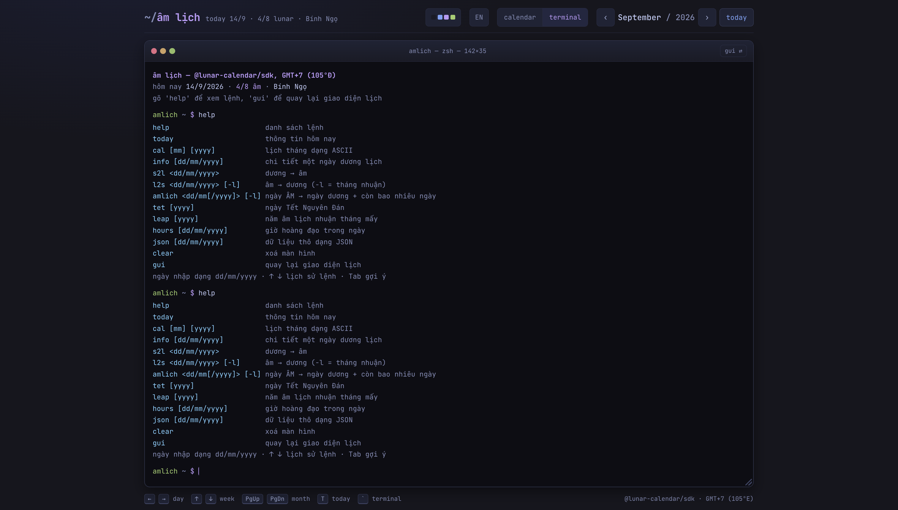

<div align="center">

# 🌙 âm lịch

**Lịch âm Việt Nam — SDK tự xây và web app**

[](https://www.npmjs.com/package/@lunar-calendar/sdk)
[](LICENSE)
[](https://www.npmjs.com/package/@lunar-calendar/sdk)

</div>


Tra cứu âm lịch, can chi, tiết khí, giờ hoàng đạo và ngày lễ Việt Nam. Chạy hoàn toàn ở trình duyệt — cài lên máy dùng được **offline**, 9 bảng màu quen thuộc với dân lập trình, song ngữ Việt/Anh.

## Chế độ terminal

Gõ lệnh thay vì bấm chuột: lịch sử lệnh `↑↓`, `Tab` gợi ý, `Ctrl+L`, kéo thả đổi kích thước (nhớ giữa các lần mở). Bấm **`` ` ``** để bật.



```
amlich ~ $ amlich 20/10          # ngày âm → ngày dương + đếm ngược
20/10/2026 âm → 28/11/2026 dương lịch (Thứ Bảy)
còn 75 ngày nữa · 10.7 tuần · khoảng 2.5 tháng

amlich ~ $ tet 2027              # ngày Tết + còn bao lâu
amlich ~ $ cal 2 2026            # lịch tháng ASCII, dương trên âm dưới
amlich ~ $ leap 2025             # năm nhuận tháng mấy
amlich ~ $ info 17/2/2026        # chi tiết một ngày
```

## SDK

```bash
npm i @lunar-calendar/sdk
```

```ts
import { solarToLunar, lunarToSolar, getDayInfo, CHINA_TIMEZONE } from '@lunar-calendar/sdk';

solarToLunar(17, 2, 2026);        // { day:1, month:1, year:2026, leap:false, uncertain:false }
lunarToSolar(15, 8, 2025);        // { day:6, month:10, year:2025 }   ← Trung Thu
getDayInfo(17, 2, 2026);          // can chi, tiết khí, giờ hoàng đạo, ngày lễ…

lunarToSolar(1, 1, 1968);                        // 29/1 — Tết Mậu Thân ở Việt Nam
lunarToSolar(1, 1, 1968, false, CHINA_TIMEZONE); // 30/1 — Trung Quốc, lệch một ngày
```

**Thiên văn tự cài đặt từ nguồn gốc**, không dùng lại thư viện có sẵn: Meeus ch.49 đầy đủ (25 số hạng + 14 hiệu chỉnh hành tinh), VSOP87 rút gọn cho kinh độ **biểu kiến** của Mặt Trời, ΔT Espenak–Meeus kết hợp số đo thực IERS. Đo được: **trăng mới lệch trung bình ~1 giây** so với bảng NASA.

Điểm khác biệt: khi thời điểm sóc rơi cách nửa đêm vài giây — trường hợp **không cài đặt nào dám chắc** — SDK trả về cờ `uncertain: true` thay vì đoán bừa.

📖 Chi tiết thuật toán, số đo độ chính xác và phân tích 122 ngày lệch: **[packages/sdk/README.md](packages/sdk/README.md)**

## Cấu trúc

```
packages/sdk/   @lunar-calendar/sdk — engine + quy tắc lịch, zero dependency
apps/web/       Vite + React PWA, dùng SDK qua workspace link
```

```bash
pnpm install
pnpm test        # 23 test: độ chính xác thiên văn + lịch sử + hồi quy 73.414 ngày
pnpm dev         # web app
pnpm build
```

## Độ tin cậy

Mọi con số dưới đây là **test tự động chạy được**, không phải tuyên bố suông:

| Kiểm chứng | Kết quả |
|---|---|
| Trăng mới 2026 so với bảng NASA/Espenak | lệch trung bình ~1s |
| Điểm chí/phân 2020–2050 so với NASA | lệch trung bình −11s |
| 6 năm Việt Nam ăn Tết lệch Trung Quốc (1968, 1985…) | tái hiện đúng cả 6, chỉ bằng đổi múi giờ |
| Đối chiếu 73.414 ngày (1900–2100) với bản phổ biến | khớp 99,83%; 122 ngày lệch **đã truy ra nguyên nhân** |
| Chu kỳ Meton (19 năm/7 tháng nhuận), tháng 29–30 ngày | ✅ |

## Ghi chú văn hoá

Trực thần và giờ hoàng đạo được trình bày như **tri thức truyền thống để tham khảo** — không phải lời khuyên hay phán mệnh.

## Giấy phép

[MIT](LICENSE)
